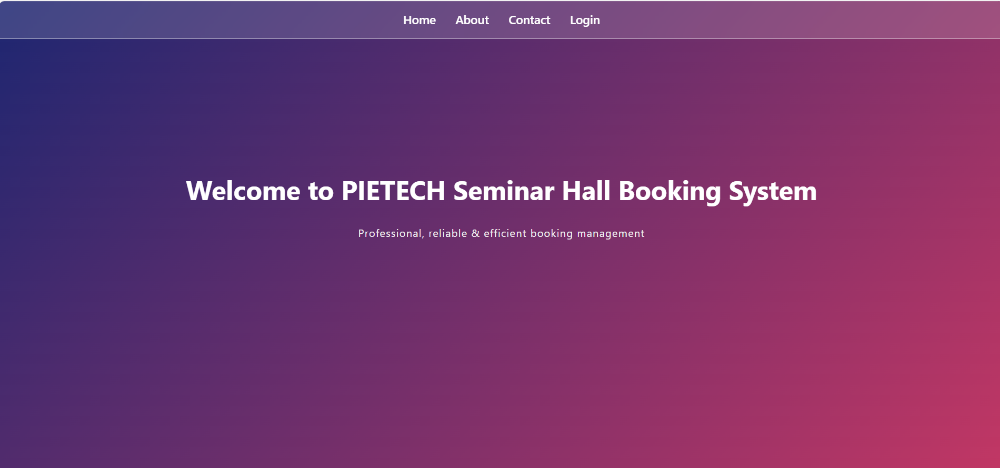
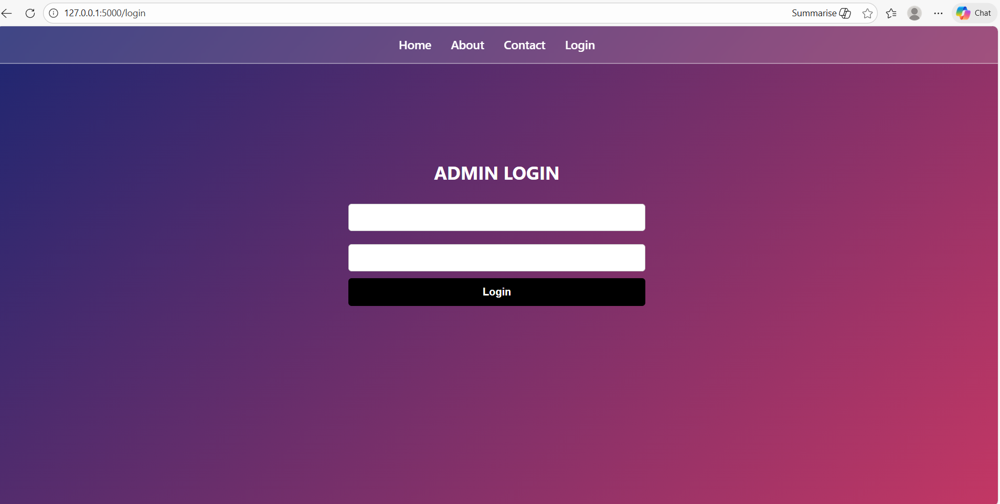
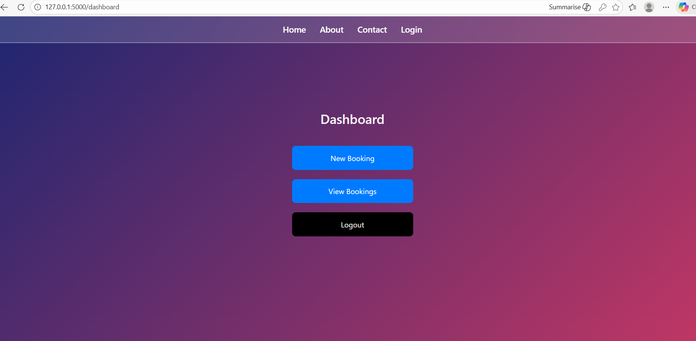
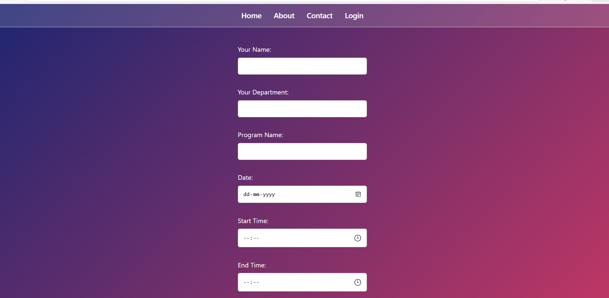
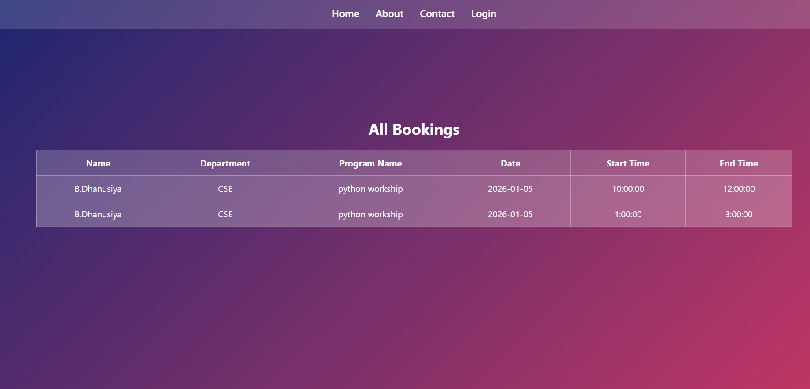

A web-based Seminar Hall Booking System developed using HTML, CSS, JavaScript (Frontend) and Python Flask (Backend) with MySQL Database integration.
This system allows users to check hall availability, book seminar halls, and manage bookings efficiently through a centralized platform.
The Seminar Hall Booking System was developed specifically to address the hall reservation challenges faced within our college campus. Traditionally, seminar hall bookings were managed manually, which often led to scheduling conflicts, miscommunication, and inefficient record maintenance. This project aims to digitize and automate the entire booking process to ensure transparency, accuracy, and convenience for students, faculty, and administrators.
The system is designed as a web-based application using HTML, CSS, and JavaScript for the frontend interface, providing a simple and user-friendly experience. The backend is implemented using Python with the Flask framework, which manages application logic and handles client requests. A MySQL database is integrated to securely store user details, booking information, and hall availability data.

The system allows users to:

1.Register and log in securely

2.Check seminar hall availability

3.Book halls for specific dates and time slots

4.Cancel bookings if required

5.Avoid double bookings through backend validation

An administrative module is included to manage users, monitor reservations, and maintain proper control over hall allocation.
This project demonstrates the practical application of full-stack web development concepts, including database management, server-side programming, authentication mechanisms, and CRUD operations. It also enhances resource management within the college by providing a centralized and automated solution for seminar hall reservations.
Overall, the system improves efficiency, reduces manual workload, and ensures systematic management of seminar hall bookings within the college environment.

Features:

1. User Registration & Login

2. View Available Seminar Halls

3. Date & Time Slot Booking

4. Prevent Double Booking

5. View Booking History

6. Admin Panel for Managing Halls & Bookings

7. MySQL Database Integration

Technologies Used:
Frontend:

1.HTML5

2.CSS3

3.JavaScript

Backend:

1.Python

2.Flask Framework

Admin Functionalities:

1.Add / Remove Seminar Halls

2.View All Bookings

3.Cancel Bookings

4.Manage Users

 Screenshots:

 Home Page

Login Page

Dashboard

Booking Page

Confirmation Page

Database

MySQL
